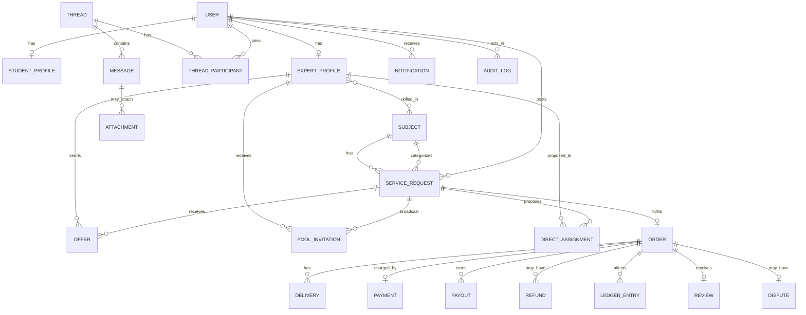

# Database / Entity Architecture

> Status: 📐 Phase 0 · Last updated: 2026-09-23 · PostgreSQL 16, Django ORM, single database

## Conventions

- PKs: `BigAutoField` internally; **public IDs are UUID4** (`id = UUID` on externally-exposed models, ADR-0008). Orders additionally carry a human sequence `number` (`ORD-2026-000123`).
- All models: `created_at`, `updated_at` (`core.TimeStampedModel`). Money: `BigInteger` minor units + `currency` char(3) (ADR-0009). Enums: Django `TextChoices`.
- No cross-app FKs that violate the dependency rule: downward FKs only (orders→accounts OK; bidding→orders via service layer storing `order_id` FK? — see note below).

> **FK vs dependency rule:** DB-level FKs may cross apps downward; upward references (e.g., `bidding`→`orders`) use a plain UUID + service-layer coordination so the app graph stays acyclic. `orders` holds `offer_id` (UUID, no FK) instead of `bidding` holding `order_id`.

## Entity relationship overview

## Entities (authoritative field list)

### accounts
- **User** (AbstractUser): `email` (unique, USERNAME_FIELD), `name`, `timezone`, `locale`, `email_verified_at`, `is_staff/is_superuser` (admin), `is_active`, `last_login_ip`. Roles derivable (`has_expert_profile`), no role bit spam.
- **StudentProfile**: user 1-1, `institution`, `country`, `bio`, `avatar`→files.Attachment.

### experts
- **ExpertProfile**: user 1-1; `status` (`pending|approved|rejected|suspended`), `headline`, `bio`, `slug` (unique, for SEO), subjects M2M, skills M2M, `years_experience`, `credentials` JSON, `verification_doc`→Attachment, `decision_notes`, `approved_at`, `list_in_directory` bool, `is_available` bool, denormalized `rating_avg`, `reviews_count`, `completed_orders_count`, `country`, `payout_status` (mirror of Stripe account: `none|pending|enabled|restricted`).

### taxonomy
- **Subject**: `name`, `slug`, `parent` (self-FK, nullable), `is_active`. **Skill**: `name`, `slug`. Curated by admin.

### service_requests
- **ServiceRequest**: student FK; `mode` (`open|managed`), `category` (integrity-relevant enum), `title`, `description`, subject FK, skills M2M, `pricing_type` (`fixed|hourly`), `budget_min`, `budget_max`, `currency`, `deadline`, `preferred_schedule` text, `status` (state machine below), `integrity_attested_at`, `integrity_policy_version`, managed fields: `quote_amount`, `review_notes`, reviewer FK; counters `offer_count`, `view_count`; `search_vector` (GIN); `expires_at`; `closed_reason`.

### bidding
- **Offer**: request FK; expert FK; `amount`, `currency`, `timeline_text`, `message`; `status` (`pending|accepted|declined|withdrawn|expired`); `responded_at`. Unique(`request`,`expert`). Index (request,status),(expert,status).

### assignments
- **PoolInvitation**: request FK; expert FK; `status` (`pending|accepted|declined|expired`); `responded_at`. Unique(request, expert).
- **DirectAssignment**: request FK; expert FK (no FK→experts? it's downward? assignments is *above* orders but lateral to experts — FK allowed: assignments→experts is lateral; rule says no upward imports — lateral domain-to-domain references go through services; store `expert_id` UUID + denormalized name for audit, decision ADR-0001); `amount`, `currency`, `deadline`, `scope_note`, `status` (`pending|accepted|declined|expired|superseded`), `expires_at`, `responded_at`, `decided_by_admin` FK.

### assignments (Phase 5 implementation notes)
- Implemented as documented, plus: UUID pks (both models); `PoolInvitation.expected_amount` (expert's advisory expectation — never the booked price); `DirectAssignment.expert` is a real user FK **plus** `expert_name` snapshot for admin listings; unique(request, expert) holds for invitations.
- Both artifacts converge through `orders.services.create_order_for_request` (the ADR-0015 factory) with `source=managed_pool|managed_direct`; managed commission (20%) snaps via `payments.config.rate_for_source`.

### orders
- **Order**: `number` unique sequence; request FK; student FK; `expert_id` UUID + expert snapshot fields (name, slug) for audit; `source` (`open_bid|managed_pool|managed_direct`); `offer_id` UUID nullable; `amount`, `currency`; `commission_rate` numeric(5,4) snapshot; `commission_amount`, `expert_amount` (computed at creation, stored); `status` (state machine); `deadline`; `revisions_allowed`, `revisions_used`; `accepted_at`,`paid_at`,`delivered_at`,`completed_at`,`cancelled_at`; `cancelled_by` FK nullable; `cancellation_reason`; `auto_approve_at`; `delivery_due_at`; `attachments` M2M→Attachment (`order_attachment` purpose, active-stage file exchange).
- **Delivery** (Phase 6): order FK (`deliveries`); `revision_number` int (0 = initial; UNIQUE(order, revision_number)); `summary`; `status` (`submitted|approved|revision_requested`); M2M attachments (purpose `delivery`); `submitted_at`; `approved_at`; `approval_source` (`student|auto|admin`).
- **OrderEvent** (Phase 6, append-only timeline): order FK (`events`); `event_type` (`created|payment_confirmed|delivered|revision_requested|redelivered|approved|auto_approved|completed|cancelled|dispute_opened|deadline_reminded`); `actor` FK nullable SET_NULL; `data` JSONB; created_at. The workspace timeline reads ONLY these rows.

### payments (Phase 7 implementation notes)
- **Payment**: order 1-1 (string FK — payments is a lower layer, ADR-0005 amendment); `gateway` (`manual|stripe`); `provider_reference` unique nullable; `amount_minor`, `currency`; `status` (`pending|requires_action|processing|succeeded|failed|canceled|refunded|partially_refunded`); `failure_reason`; `instructions` (static manual-rails text snapshot); `refunded_minor`; `paid_at`, `canceled_at`. **No PaymentAttempt/Transaction tables** — failure/retry history lives in status transitions + audit + webhook events (documented in payments.md).
- **Refund**: payment FK; `amount_minor`; `reason` (`expert_fault|platform_fault|mutual|admin_decision|dispute_resolution`); `note`; `status` (`pending|succeeded|failed`); `provider_reference`; `initiated_by`; `processed_at`. Partial refunds validated against `amount_minor − refunded_minor`; ledger writes proportional commission/expert-credit reversals so the BR-32 identity holds.
- **Payout**: order FK; expert FK; `amount_minor` (remaining expert-credit balance at scheduling); `status` (`scheduled|in_transit|paid|failed|reversed`); `provider_reference`; `failure_reason`; `settled_at`. One payout per order (BR-30; <$10 rolls forward).
- **Payout**: order FK; expert user FK; `stripe_transfer_id`; `amount`, `currency`; `status` (`scheduled|in_transit|paid|failed|reversed`); `failure_reason`; `scheduled_at`,`paid_at`.
- **Refund**: order FK; payment FK; `stripe_refund_id`; `amount`; `reason` enum; `initiated_by` FK; `status` (`pending|succeeded|failed`).
- **LedgerEntry** (append-only): `entry_type` (`charge|commission|expert_credit|refund|payout|fee|adjustment`); order FK nullable (PROTECT); user FK nullable (SET_NULL); `amount_minor` signed BigInteger; `currency`; `description`; `provider_object_id`; `created_at`. No updates/deletes ever (model save/delete guards; admin fully read-only). Nightly `payments.ledger_check` enforces per-order `charge + refund == commission + expert_credit + fee`.
- **WebhookEvent**: `provider`; `event_id` unique (replay protection); `type` (normalized `payment.succeeded|payment.failed|refund.succeeded`); `payload` JSONB; `status` (`received|processed|failed`); `error`; `received_at`, `processed_at`. Failed events redeliver from admin against the stored (verified-at-receipt) payload.
- **PlatformConfig** (in core, singleton row): commission rates, TTLs, limits, quotas (see business-model/business-rules keys), `default_currency`, `price_guidance` JSONB.

### messaging
- **Thread**: `context_type` (`request|order|dispute`); nullable FKs to each context (UUID + FK where downward); `last_message_at`; `is_locked`.
- **ThreadParticipant**: thread FK, user FK, `last_read_at`. Unique(thread,user).
- **Message**: thread FK; sender FK; `body`; `is_hidden`; `hidden_reason`. Index (thread, created_at).

### files
- **Attachment**: `key` (storage path), `original_name`, `content_type`, `size`, `sha256`, `purpose`, `access` (`public|participants|admin_only`), uploader FK, `is_deleted`. Referenced by owner models (requests, deliveries, messages, disputes, profiles) via their own FKs (`delivery.primary_file` etc. or M2M `files`).

### notifications
- **Notification**: recipient FK; `type`; `title`; `body`; `data` JSONB; `read_at`; `emailed_at`. Index (recipient, read_at, created_at).
- **NotificationPreference**: user FK; `category`; `email_enabled` bool. Unique(user,category).

### reviews
- **Review**: order 1-1; author FK (student); expert user FK; `rating` 1-5 int; `sub_quality/sub_communication/sub_timeliness` nullable; `body`; `status` (`published|hidden`); `expert_reply`; `replied_at`; `edited_at`.

### disputes
- **Dispute**: order 1-1; `opened_by` FK; `reason` enum; `description`; `status` (`open|under_review|awaiting_response|resolved|closed`); `outcome` enum nullable; `resolution_notes`; `resolved_by` FK; `resolved_at`; `refund_amount` nullable.

### audit
- **AuditLog**: `actor` FK nullable (system=null); `action`; `object_type`; `object_id`; `changes` JSONB (before/after); `ip`; `user_agent`; `created_at`. Index (object_type, object_id), (actor, created_at). Insert-only.

### Phase 4 implementation notes (ADR-0015)
- `ServiceRequest`/`Offer` pks are UUIDs (non-enumerable URLs; Attachment precedent).
- `Order.expert_id` stores the **user pk** (BigInteger) + `expert_name`/`expert_slug` snapshot — ADR-0001's lateral rule with the concrete type fixed.
- `search_vector` (GIN, full-text) is **deferred**; Phase 4 ships simple PostgreSQL filters (subject/skill/category/pricing/deadline/budget/q ilike) per the roadmap's optimize-when-measured rule.
- Order rows are created at selection in `awaiting_payment` only; delivery/revision columns exist but transition in the payments phase.
- `service_requests` managed columns (`quote_amount`, `review_notes`, `reviewer`) exist now so managed service needs no second migration wave.

## Key status enums (canonical)

| Model | Values |
|---|---|
| ServiceRequest.status | `draft, open, in_review, pooled, matched, in_progress, completed, rejected, cancelled, expired` |
| Order.status | `awaiting_payment, active, delivered, revision_requested, completed, disputed, cancelled` (+ `refunded` flag via refund records; `delivered/revision_requested` re-enter on loop) |
| Offer.status | `pending, accepted, declined, withdrawn, expired` |
| Payment.status | `requires_action, processing, succeeded, failed, canceled, refunded, partially_refunded` |
| Payout.status | `scheduled, in_transit, paid, failed, reversed` |
| Dispute.status | `open, under_review, awaiting_response, resolved, closed` |

## Indexing & performance notes

- GIN: `search_vector` (requests); trigram GIN (`pg_trgm`) on expert name/headline.
- Composite: offers(request,status), orders(expert_id,status), orders(student,status), notifications(recipient,read_at), ledger(order), audit(object).
- Constraints: DB CHECKs for amount ≥ 0 where applicable, rating 1..5, unique offer/invitation per pair, order↔payment 1-1.
- Expected MVP scale: thousands of requests, tens of thousands of orders/ledger rows — trivial for Postgres with these indexes.

## Migrations & data lifecycle

- Migrations are code-reviewed artifacts; squashing only at phase boundaries. Seed data via `scripts/seed_demo.py` (management command) — see README.
- Retention jobs: notifications 90d, chat attachments per files doc, audit logs ≥ 2 years (kept), soft-deleted rows purged per retention policy.
