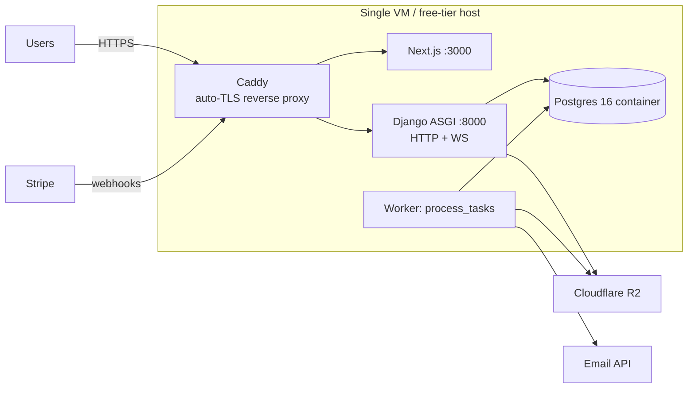

# Deployment Architecture

> Status: 📐 Phase 0 · Last updated: 2026-09-23 · Related: [costs](../operations/costs.md)

## Topology (MVP): one small box, one compose file

- Everything from `docker-compose.yml` + two images: `Dockerfile.backend` (python slim, gunicorn? **no — uvicorn** for ASGI/WS) and frontend Node image (or static `next build` + node server).
- Caddy terminates TLS with automatic Let's Encrypt; proxies `/api/*`, `/admin/*`, `/ws/*`, `/files/*` → Django (WS upgrade handled), everything else → Next.
- **Constraint:** one ASGI process (in-memory channel layer) — scale = bigger VM until Redis switch (see scalability).

## Hosting options (free-first, decision guide)

| Option | Cost | Verdict |
|---|---|---|
| **Fly.io** | ~$2–5/mo (shared-cpu-1x, 1 GB) + volume | primary recommendation: docker-native, volumes for Postgres, cheap |
| **Railway** | $5/mo hobby-ish | easiest DX; slightly pricier |
| **Render** | free web tier exists but **sleeps** (kills WS + slow first hit) → paid $7 | acceptable paid fallback |
| **Oracle Cloud Always Free** (ARM 4 OCPU/24GB) | $0 genuinely | best free option for a capable owner; more ops burden |
| Hetzner CX22 | ~€4/mo | best $/perf if a tiny budget exists |

Frontend: same VM (simplest) **or** Vercel Hobby free (unlimited static+SSR; needs `NEXT_PUBLIC_API_URL` pointing at the VM). Both supported — same repo, two deploy paths documented in README.

Managed DB alternative: **Neon free tier** (0.5 GB, autosuspend) — recommended when the VM is small; DB outside → backups become provider-managed PITR (see backup-recovery).

## Deploy procedure (documented runbook, scripted)

1. Push to `main` (or tag) → CI green.
2. On the VM: `git pull && docker compose pull && ./scripts/deploy.sh`:
   - `docker compose build`, `migrate` (backend container), `collectstatic`, rolling `up -d`, health-check `/healthz`, smoke: login + one API GET.
   - Rollback = `git checkout <previous tag> && deploy.sh` (stateless app; DB migrations are forward-only, so migrations must be backward-compatible per policy: additive-first).
3. Stripe webhook endpoint is env-stable (`/api/v1/payments/webhook/stripe`) — no per-deploy changes.
4. Downtime: seconds (container restart); acceptable MVP; blue/green noted as post-MVP.

## Docker & compose details

- `docker-compose.yml` (dev): `db` (postgres:16-alpine, volume), `backend` (uvicorn, autoreload mount), `worker`, `frontend` (next dev), Caddy optional profile. `docker-compose.prod.yml` overrides: images, no mounts, resource limits, log rotation, restart policies, `depends_on` healthchecks.
- All containers non-root; backend image multi-stage (build wheels → slim runtime).

## Pre-launch checklist (Phase 13)

Domain + DNS, TLS, Stripe live keys + webhook, R2 bucket + CORS, email sender domain verified (SPF/DKIM), env file review (no DEBUG, strong SECRET_KEY), backups scheduled + restore tested, uptime monitor, admin URL + staff accounts, ToS/privacy/integrity policy pages live, seed data removed (`scripts/reset_prod.py` guard against running seed in prod).
