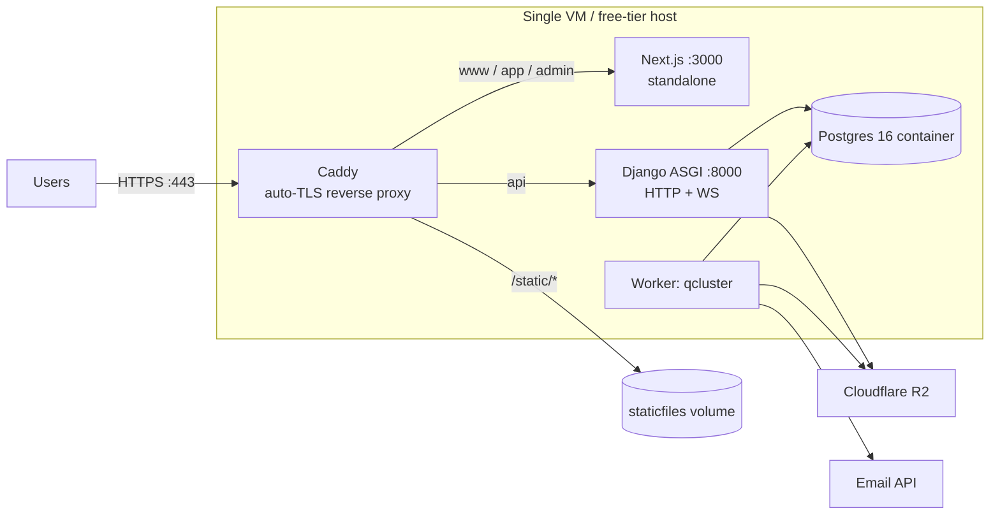

# Deployment Architecture

> Status: ✅ **implemented (Phase 12)** — the topology below is built and
> committed. Nothing here has been deployed to a real host yet: no hosting,
> DNS, storage or email credentials exist in this project. See
> [Deployment status](#deployment-status-read-this-first).
> Last updated: Phase 12 · Related: [costs](../operations/costs.md) ·
> [environments](environments.md) · [backup-recovery](backup-recovery.md) ·
> [observability](observability.md) · [operator runbook](../deployment/PRODUCTION-DEPLOYMENT.md) · ADR-0016, ADR-0017

## Deployment status (read this first)

Three different things get confused with each other. They are tracked
separately and honestly:

| Stage | State | Evidence |
|---|---|---|
| **Deployment architecture prepared** | ✅ done | `docker-compose.prod.yml`, `deploy/Caddyfile`, `backend/Dockerfile` (`prod`), `scripts/{deploy,rollback,smoke_test,backup_db,restore_backup}.sh`, `.github/workflows/deploy.yml`, `.env.prod.example` |
| **Staging deployed** | ❌ not done | needs a host + domain. Blocked on owner action, not on code. |
| **Production deployed** | ❌ not done | same. |

What *has* been executed and verified locally, in this repo:

- the production **smoke test against a real running stack** under
  `config.settings.prod` — 22/22 checks passed;
- the production **safety checks** refusing a dangerous config and accepting a
  correct one;
- a full **backup → encrypt → restore → verify** drill on a seeded database
  (see [backup-recovery](backup-recovery.md));
- the **enforcing, nonced CSP** on a production Next.js build.

What cannot be verified here: TLS issuance, DNS, real object storage, real
email delivery, and the deploy scripts' SSH path. Those need the host.

## Topology: one small box, one compose file


```mermaid
flowchart LR
    U[Users] -->|HTTPS :443| C[Caddy<br/>auto-TLS reverse proxy]
    C -->|www / app / admin| N[Next.js :3000<br/>standalone]
    C -->|api| D[Django ASGI :8000<br/>HTTP + WS]
    C -->|/static/*| SV[(staticfiles volume)]
    subgraph VM["Single VM / free-tier host"]
        C; N; D; W[Worker: qcluster]
        PG[(Postgres 16 container)]
    end
    D --> PG; W --> PG
    D --> R2[Cloudflare R2]
    W --> R2; W --> E[Email API]
```

Four application services plus ingress, all in `docker-compose.prod.yml`:

| Service | Image/target | Notes |
|---|---|---|
| `caddy` | `caddy:2-alpine` | the **only** service publishing ports (80, 443, 443/udp). Auto-TLS. |
| `web` | `frontend/Dockerfile` → `prod` | Next.js standalone, non-root |
| `api` | `backend/Dockerfile` → `prod` | uvicorn, **exactly one worker** |
| `worker` | same image, worker entrypoint | `qcluster`; waits for the API's `/readyz` |
| `db` | `postgres:16-alpine` | **no published port** — reachable only on the compose network |

Two constraints that are deliberate, not oversights:

- **One ASGI process.** The channel layer is in-memory (ADR-0004: no Redis), so
  a second worker would silently break WebSocket fan-out. Scaling = a bigger
  box, until the Redis switch documented in [scalability](scalability.md).
- **The database is not exposed.** Nothing outside the compose network can
  reach Postgres. Administration goes through the host's shell.

### Why Caddy, why one box

See **ADR-0016**. Short version: automatic TLS with zero certificate
management, one config file, and a single `docker compose up -d` as the entire
deploy. The free-first rule (ADR-0002) rules out managed platforms whose free
tiers sleep — sleeping kills WebSockets.

## Hosting options (free-first, decision guide)

| Option | Cost | Verdict |
|---|---|---|
| **Hetzner CX22** | ~€4/mo | best $/perf; recommended if any budget exists |
| **Oracle Cloud Always Free** (ARM 4 OCPU/24 GB) | $0 genuinely | best true-free option; more ops burden, capacity is not guaranteed |
| **Fly.io** | ~$2–5/mo | docker-native, volumes for Postgres |
| **Railway** | ~$5/mo | easiest DX, slightly pricier |
| **Render** free tier | $0 but **sleeps** | ❌ rejected — sleeping breaks WS and cold-starts badly |

Any of them works: the unit of deployment is a compose file, not a
vendor-specific manifest. That is the point of ADR-0016 — no lock-in.

Managed DB alternative: **Neon free tier**. Point `DATABASE_URL` at it and
remove the `db` service; backups become provider-managed PITR. The app does not
care.

## Host bootstrap (one time)

```bash
# 1. Docker
curl -fsSL https://get.docker.com | sh
sudo usermod -aG docker "$USER"   # log out / back in

# 2. Checkout
sudo mkdir -p /srv/hem && sudo chown "$USER" /srv/hem
git clone <repo-url> /srv/hem && cd /srv/hem

# 3. Environment file — never committed
cp .env.prod.example .env.production      # or .env.staging
chmod 600 .env.production
$EDITOR .env.production                   # fill EVERY CHANGE_ME

# 4. Generate real secrets
python3 -c 'import secrets; print(secrets.token_urlsafe(64))'   # SECRET_KEY
openssl rand -base64 48                                         # BACKUP_PASSPHRASE
openssl rand -hex 16                                            # MANUAL_WEBHOOK_SECRET

# 5. Firewall: only 22/80/443
sudo ufw allow 22,80,443/tcp && sudo ufw allow 443/udp && sudo ufw enable
```

DNS, before the first deploy — four A/AAAA records at the host's IP:

| Record | Points to | Serves |
|---|---|---|
| `www` | VM IP | `(marketing)` |
| `app` | VM IP | `(auth)` + `(app)` |
| `admin` | VM IP | `(portal)` |
| `api` | VM IP | Django HTTP + WS |

The apex redirects to `www` (handled in the Caddyfile). Caddy issues
certificates on first request — DNS must resolve **before** the first deploy or
ACME fails.

## Deploy procedure

```bash
./scripts/deploy.sh --env staging               # or: --env production
./scripts/deploy.sh --env production --ref v1.2.0
```

`scripts/deploy.sh` is the runbook, executable:

1. **Refuse a dirty tree.** A deploy must be reproducible from a git ref.
2. **Record the current release** in `.deploy-state-<env>` — this is what
   rollback returns to.
3. **Back up the database first** (production only, unless `--skip-backup`).
   Migrations are the risky part of a deploy; the backup precedes them.
4. `docker compose build` then `up -d`.
5. **Wait for health** — poll `/healthz` up to 60×5 s.
6. **Smoke test** (below).
7. On success: write the new state. **On any failure: invoke
   `scripts/rollback.sh` automatically.**

Container start order is enforced by the entrypoint, not by hope —
`backend/docker/entrypoint.prod.sh`:

```
wait for the database (30 × 2 s)
  → manage.py check --deploy --tag production --fail-level WARNING
  → manage.py migrate --noinput
  → manage.py collectstatic --noinput --clear
  → exec uvicorn
```

The `check` step is a **fail-closed gate**: a container with a dev
`SECRET_KEY`, console email, local file storage, the default `admin/` URL or a
non-HTTPS callback URL refuses to boot rather than serving a broken
production. Verified in both directions, and asserted by CI so it cannot
regress.

## Rollback

```bash
./scripts/rollback.sh --env production                 # previous release
./scripts/rollback.sh --env production --to v1.1.0     # a specific ref
```

Checkout → rebuild → health → smoke → update state.

> **Rollback does not restore the database.** That is deliberate. Migration
> policy is **forward-only and additive-first**: add columns/tables, never drop
> or rename in the same release that ships code depending on them. A code
> rollback is then always safe against a newer schema. If a migration itself
> corrupted data, that is a restore, not a rollback — use
> `scripts/restore_backup.sh` and accept the RPO.

## Smoke test

```bash
./scripts/smoke_test.sh --api https://api.example.com --web https://app.example.com
```

22 assertions across seven groups. It is not a "is the port open" check — it
verifies the security posture that Phase 11's audit demanded:

| Group | Asserts |
|---|---|
| Availability | `/healthz`, `/readyz`, web root all 200 |
| Database | the health probe reports a reachable DB |
| API contract | API root payload, OpenAPI schema served |
| Transport | HSTS, `X-Content-Type-Options`, `Referrer-Policy` |
| **CSP** | **enforcing** (not report-only), carries a nonce, **the header nonce matches the rendered document**, no `unsafe-inline`/`unsafe-eval` in `script-src` |
| Hygiene | `X-Frame-Options: DENY`, no debug traceback, 404 envelope |
| Auth boundary | `/api/v1/me` and `/api/v1/ops/kpis` reject anonymous callers (401) |
| Legal | `/terms`, `/privacy`, `/academic-integrity` reachable |

Exit code 1 means **roll back**. `--allow-report-only-csp` exists for the
staging canary window only.

Last run — against a local stack under `config.settings.prod`, 2026-09-28:
**22 passed, 0 failed**.

## CI/CD

`.github/workflows/ci.yml` — 5 jobs on every push: Backend, Frontend,
Docs-sync, **Deploy-config**, Compose-smoke.

`.github/workflows/deploy.yml` — `workflow_dispatch` (choose staging or
production) or a `v*` tag:

1. **verify** — refuses to deploy a commit CI has not gone green on, and
   re-validates the deployment artifacts.
2. **deploy** — runs inside a GitHub **Environment**. Required reviewers on the
   `production` environment are what make "approved release" a real gate; the
   workflow cannot approve itself.
3. SSH → `scripts/deploy.sh` on the host → **external** smoke test from the
   runner (exercising real DNS and TLS, not just localhost) → automatic
   rollback on failure.

Without the deployment secrets the workflow **stops at preflight with an
explicit error**. It never pretends to have deployed.

## Staging isolation

Staging is the same compose file with a different env file (ADR-0016) —
identical code path, so staging actually predicts production.

What keeps the two apart:

- `name: hem-${DEPLOY_ENV}` in the compose file → separate container names,
  **separate volumes**, separate networks. Staging cannot touch production's
  database even on the same host.
- separate `.env.staging` / `.env.production`, both `chmod 600`, both gitignored;
- separate domains and therefore separate certificates;
- `DEPLOY_ENV` is visible to the application: `seed_demo` refuses to run when
  it is `production`, and the safety checks vary by environment.

## Payment provider readiness

`PAYMENT_GATEWAY=manual` in every environment. Per ADR-0005 the provider seam
exists and is exercised end-to-end by the manual gateway, but **no Stripe
account, keys or webhook endpoint exist** and none are fabricated. Activation
is an owner action:

1. create the account, obtain live keys;
2. set `PAYMENT_GATEWAY=stripe`, `STRIPE_SECRET_KEY`, `STRIPE_WEBHOOK_SECRET`;
3. point the provider's webhook at
   `https://api.<domain>/api/v1/payments/webhooks/` — the path is env-stable and
   needs no per-deploy change;
4. re-run the smoke test and one live order cycle.

Until then the manual gateway is the payment path, and it is fully functional.

## Owner actions required before a real deploy

Nothing below can be done from inside this repository.

| # | Action | Unblocks |
|---|---|---|
| 1 | Provision a host (see table above) | everything |
| 2 | Register a domain; point `www`/`app`/`admin`/`api` at it | TLS, CORS, cookies |
| 3 | Create a Cloudflare R2 bucket + API token | `FILE_STORAGE=r2` (`hem.E011` blocks boot on `local`) |
| 4 | Verify an email sender domain (SPF/DKIM) at Brevo/Resend | `EMAIL_BACKEND_MODE` (`hem.E010` blocks boot on `console`) |
| 5 | Fill `.env.staging` / `.env.production` from `.env.prod.example` | the deploy |
| 6 | Add repo secrets `DEPLOY_HOST`, `DEPLOY_USER`, `DEPLOY_SSH_KEY`, `DEPLOY_PATH`; vars `API_DOMAIN`, `APP_DOMAIN`; create the `staging` and `production` Environments with required reviewers on production | CD |
| 7 | Create an UptimeRobot monitor on `https://api.<domain>/healthz` | [observability](observability.md) |
| 8 | Add the backup cron (see [backup-recovery](backup-recovery.md)) and store `BACKUP_PASSPHRASE` in a password manager | durability |

## Pre-launch checklist (Phase 12)

| # | Item | State |
|---|---|---|
| 1 | Domain + DNS | ⬜ owner |
| 2 | TLS | ✅ automatic (Caddy) — activates on first request |
| 3 | Payment provider live keys + webhook | ⬜ owner (manual gateway meanwhile) |
| 4 | R2 bucket + CORS | ⬜ owner (enforced by `hem.E011`) |
| 5 | Email sender domain verified | ⬜ owner (enforced by `hem.E010`) |
| 6 | Env review: no DEBUG, strong `SECRET_KEY` | ✅ enforced by `hem.E001`/`E002` |
| 7 | Backups scheduled + **restore tested** | ✅ drill passed; cron is owner-side |
| 8 | Uptime monitor | ⬜ owner (probe + runbook documented) |
| 9 | Admin URL changed + staff accounts | ✅ enforced by `hem.W006` |
| 10 | ToS / privacy / integrity pages live | ✅ shipped, linked from the footer |
| 11 | Seed data absent in production | ✅ `seed_demo` refuses `DEPLOY_ENV=production` |

> Phase 0 named a `scripts/reset_prod.py` for item 11. It was not built: the
> guard was moved **into** `seed_demo` itself, which is strictly safer — a
> cleanup script only helps if someone remembers to run it, whereas a refusal
> cannot be forgotten. Recorded here rather than silently dropped.
