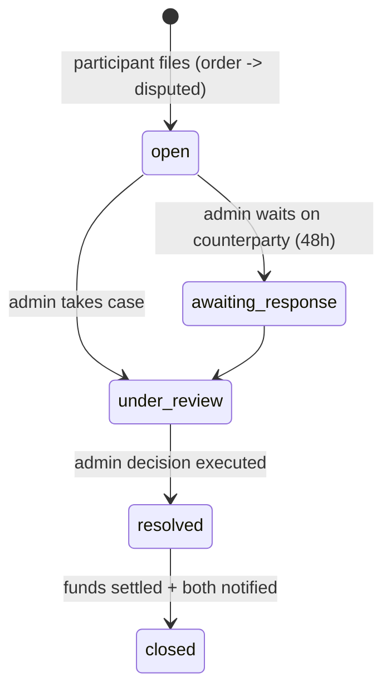

# Disputes

> Status: 📐 Phase 0 · Last updated: 2026-09-23 · Related: [payments](payments.md), [order-lifecycle](order-lifecycle.md)

## Principles

- Disputes are **admin-mediated** in MVP (no arbitration marketplace). SLA: first response 24h, resolution 72h (BR-40/41).
- Opening a dispute **freezes the order's payout** and stops the auto-approve timer.

## Who can open & when

- Student or expert (participant of the order) — while order is `active`, `delivered`, `revision_requested`, or within **7 days** after `completed`.
- One open dispute per order. Opened from the order page with: reason enum (`quality_below_expectations`, `expert_unresponsive`, `deadline_missed`, `scope_disagreement`, `payment_issue`, `integrity_concern`, `other`), description, evidence attachments.

## Lifecycle

- Both parties communicate inside the **dispute thread** (chat context `dispute`); admin has audited access to the underlying order thread and evidence.
- Either side can propose settlement ("I agree to refund / to partial X") — admin still executes.

## Outcomes (BR-41) — executed by admin action

| Outcome | Money execution | Order ends as |
|---|---|---|
| `refund_student_full` | full refund (BR-31 matrix) | `cancelled` (refunded) |
| `refund_student_partial` | admin-entered amount refunded; remainder transferred to expert | `completed` (with flag) |
| `release_expert` | full transfer to expert | `completed` |
| `split` | explicit student/expert split amounts | `completed` (with flag) |
| `no_fault_close` | freeze lifted, flow resumes | back to prior order state |

Every outcome: refund/transfer jobs, ledger entries, both parties emailed with written rationale, audit log. Integrity `other`-flagged cases additionally route to the moderation queue (BR-13).

## Fraud patterns watched (documented guidance for admins)

Repeated refund-seeking after full delivery; expert demanding off-platform payment mid-order; first-delivery-late-then-dispute loops; collusion self-dealing reviews. Admin notes are internal-only.
