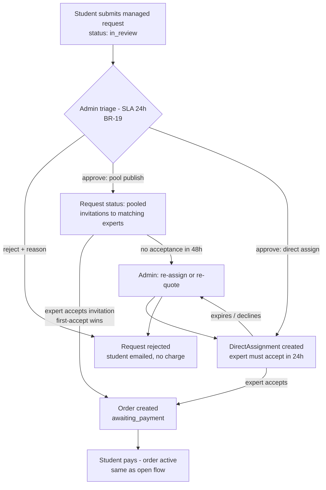
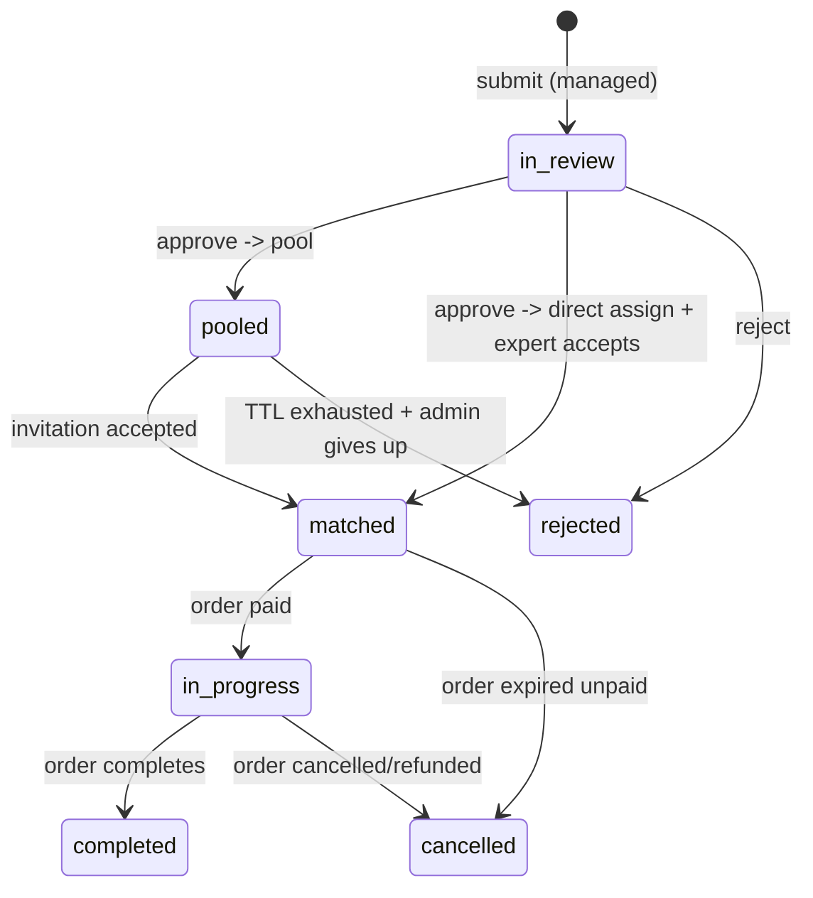

# Managed Service — Routing & Assignment Workflow

> Status: 📐 Phase 0 · Last updated: 2026-09-23

Managed mode differs only in the **match** step: the platform (admin) takes routing responsibility. Everything after `Order` created is identical to the open flow ([order-lifecycle](order-lifecycle.md)).

## Flow

## Admin triage actions

| Action | Effect |
|---|---|
| `approve_pool` | request → `pooled`; create `PoolInvitation` rows for all approved experts matching subject; notify them |
| `assign_expert(expert, price, deadline)` | create `DirectAssignment(pending, expires_at=+24h)`; notify expert; student sees quote |
| `reject(reason)` | request → `rejected`; email student; no charge ever happened |

Triage helpers: price guidance table per subject/category (PlatformConfig JSON), expert load indicator (open orders), expert rating.

## Pool invitation (`PoolInvitation`)

- One row per invited expert: statuses `pending → accepted | declined | expired`.
- **First-accept wins** (DB row lock on the request inside the accept transaction; losers get "already filled" notice).
- Accepting creates the order at the **platform-set price** (`request.quote_amount` — set at approval; visible to student before any charge).
- Window 48h (`invitation_ttl_hours`), then `expired`; admin re-broadcasts or rejects.

## Direct assignment (`DirectAssignment`)

- Admin proposes: expert, amount, deadline, scope note.
- Expert: accept (24h TTL) → order `awaiting_payment` with the quoted price; decline (optional reason) → back to admin for re-assignment (BR-21).
- Student confirms by paying; if the student doesn't pay within 72h, order auto-cancels and admin follows up.

## State machine (request, managed mode)

## Pricing in managed mode

- Admin sets the quote using the subject price guidance; commission = managed rate (20% default) snapshotted on the order.
- Student sees the quote on: triage approval email, request page, and order payment screen — **before** any charge (BR-22). Payment only happens on the order.

## SLAs & escalation

| Step | Target | Breach handling |
|---|---|---|
| Triage | 24h | Dashboard aging flag; email digest to admin |
| Expert invitation response | 48h | expiry → re-broadcast |
| Direct assignment response | 24h | expiry → re-assign |
| Student payment after match | 72h | auto-cancel + admin follow-up |

## Why pool & direct share one `Order` pipeline

The order doesn't care how the match happened — `source` field records `managed_pool` / `managed_direct` / `open_bid` for analytics and commission differences. This keeps delivery/payment/disputes single-implementation (core architectural decision, see [system-architecture](../architecture/system-architecture.md)).
