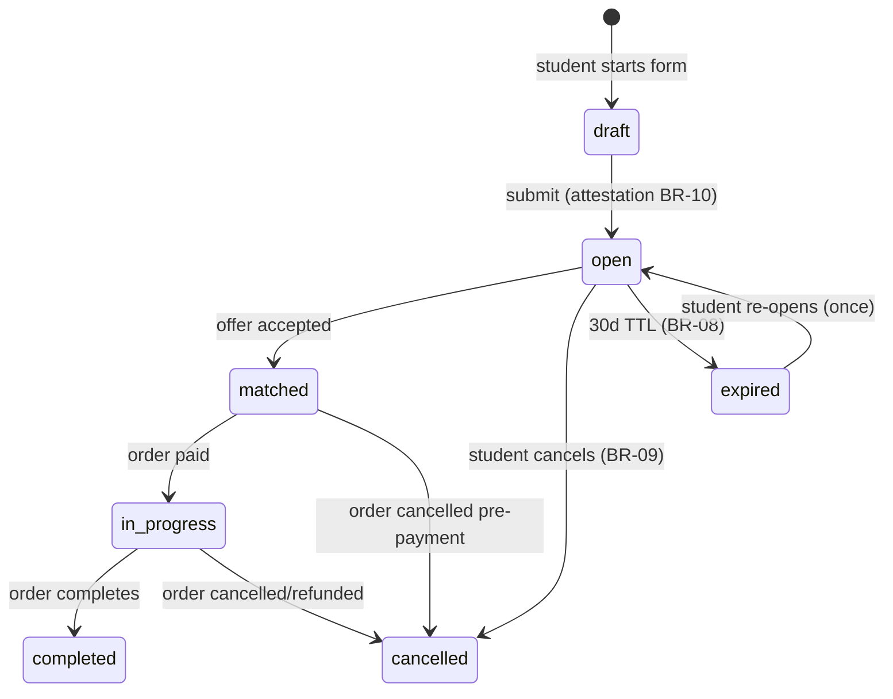
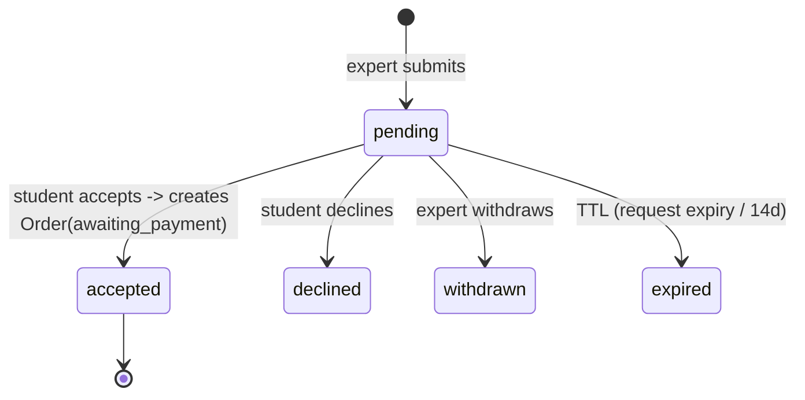

# Open Marketplace — Bidding Workflow

> Status: 📐 Phase 0 · Last updated: 2026-09-23

## Actors & surfaces

- Student: creates request, compares offers, accepts one.
- Expert (approved only): browses open requests matching their subjects, sends one offer per request.
- System: visibility rules, TTLs, state transitions, notifications.

## Visibility rules

- An `open`-mode request with status `open` is visible to **all approved experts** whose subjects include the request's subject (experts can also browse other subjects explicitly).
- Open requests are **not** public to guests/other students — request details stay behind auth (privacy + integrity context).
- Offer counts and budget ranges are visible to experts; other experts' identities/messages are **not** shown on the request (blind bidding — prevents price collusion; expert sees only own offer vs the request).

## State machines

### Request (open mode)

### Offer (BR-15..18)

## Step-by-step

1. **Expert discovers** request via `/expert/opportunities` (filtered board, realtime badge on new matches).
2. **Expert reviews** full brief + attachments (secure view). May open a clarification thread with the student.
3. **Expert sends offer**: price (min enforced), proposed timeline, message. UI shows net after commission. `Offer(request, expert)` unique — one offer, editable while pending.
4. **Student compares** offers on the request page (rating, completed orders, price, timeline, message). Can message any offering expert.
5. **Accept**: single click + confirm → atomically (transaction):
   - offer → `accepted`, sibling pending offers → `declined(auto)`,
   - request → `matched`,
   - `Order` created (source=`open_bid`, amounts & commission snapshot),
   - expert + student notified.
6. **Awaiting payment** (see [order-lifecycle](order-lifecycle.md)) — expert is told not to start.
7. Non-accepted offers expire with the request; experts get closure notifications.

## Guardrails & anti-gaming

- Rate limit: ≤ 20 pending offers per expert (quality over spam).
- Offer amounts are binding: acceptance creates the order at the offered price; experts cannot raise price after acceptance (only via admin amendment pre-payment).
- Integrity reports on requests auto-pause visibility until admin review (BR-11).
- Students cannot see expert identities across requests (prevents harvesting); they see offers only on their own requests.

## Notifications matrix (see notifications doc for catalog IDs)

| Event | Student | Expert |
|---|---|---|
| New offer | realtime + email | — |
| Offer accepted | realtime | realtime + email ("awaiting payment") |
| Offer declined/withdrawn/expired | — | realtime (batched) |
| New matching request | — | realtime + digest |
