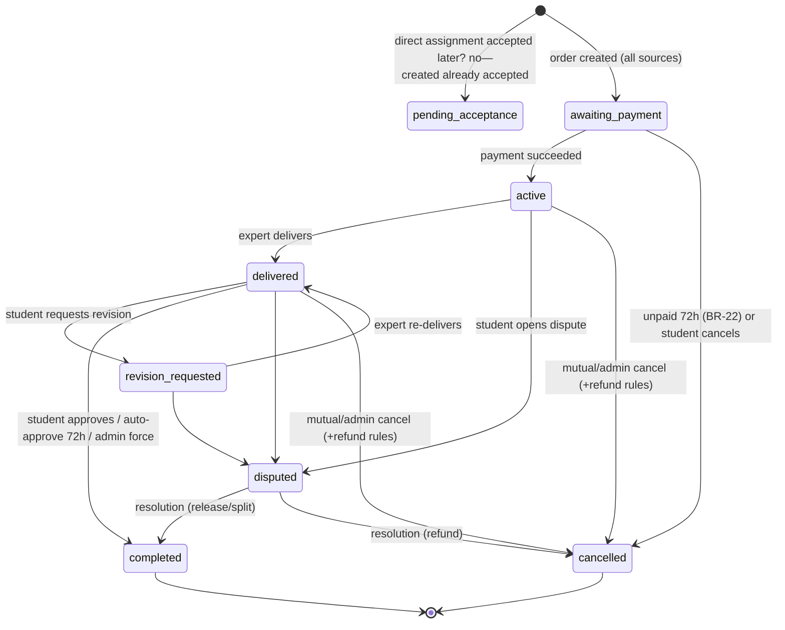

# Order Lifecycle — Delivery, Revisions, Completion, Cancellation

> Status: 📐 Phase 0 · Last updated: 2026-09-23 · Related: [payments](payments.md), [disputes](disputes.md)

The `Order` is the single contract between student and expert, regardless of match source (`open_bid` | `managed_pool` | `managed_direct`). It snapshots: parties, request reference, scope (title + description ref), agreed amount, commission rate, deadline, revision allowance.

## State machine

`pending_acceptance` exists only in the `DirectAssignment` state, not on the order — orders are created already accepted (keeps one order state machine; assignment acceptance precedes creation).

## Stage details

### awaiting_payment
- Student sees Pay button (Stripe Elements) or manual instructions (manual-gateway mode).
- Auto-cancel after 72h unpaid; expert auto-reminded after 24h. No work is expected (BR-23).

### active
- Deadline countdown visible to both. T-24h warning to expert (job).
- Either party can open the chat thread; files can be exchanged (purpose `order_attachment`).
- Late-delivery path: expert may propose new deadline in thread; student accepting (UI action) extends `deadline` — recorded in audit.

### delivered → revision loop (BR-24)
- `Delivery` record: summary + files + `revision_number` (0 = initial).
- Student response: approve / request revision (with required change list) / open dispute.
- Auto-approval: job checks deliveries with no student action for 72h → approve (BR-24). Countdown visible.
- Revision limit: `revisions_included` (2 open / 3 managed). When exhausted, the revision button hides; options: approve, dispute, or admin amendment.

### completed
- Triggers (BR-25): student approve · auto-approve · admin force-approve (dispute).
- Effects: payout scheduled (payments doc), review window opens, request → `completed`, both notified.

### cancelled
- Paths per BR-26..28: pre-payment (free), expert-fault (full refund), mutual, student-fault (admin decides refund net of fees / partial / none-with-compensation), admin intervention.
- Cancellation records `cancelled_by`, `cancellation_reason` (enum), refund linkage.

### disputed
- Payout frozen; state machine of its own — see [disputes](disputes.md).

## Timers & background jobs (all DB-queue driven)

| Job | Schedule | Effect |
|---|---|---|
| `orders.auto_approve_deliveries` | every 15 min | approve delivered orders past 72h |
| `orders.awaiting_payment_sweeper` | hourly | cancel unpaid >72h |
| `orders.deadline_reminder` | hourly | T-24h expert warning |
| `orders.auto_cancel_overdue` | daily | flag overdue >24h grace for admin/student action (BR-26) |

## Concurrency & integrity rules

- All transitions go through the `orders.services` layer with `select_for_update` on the order row — double-approve/double-cancel is impossible.
- State transitions are validated (illegal transitions raise 409) and emit domain events (notifications + audit).
- Amount fields are immutable post-payment; amendments require admin and are ledger-visible.
