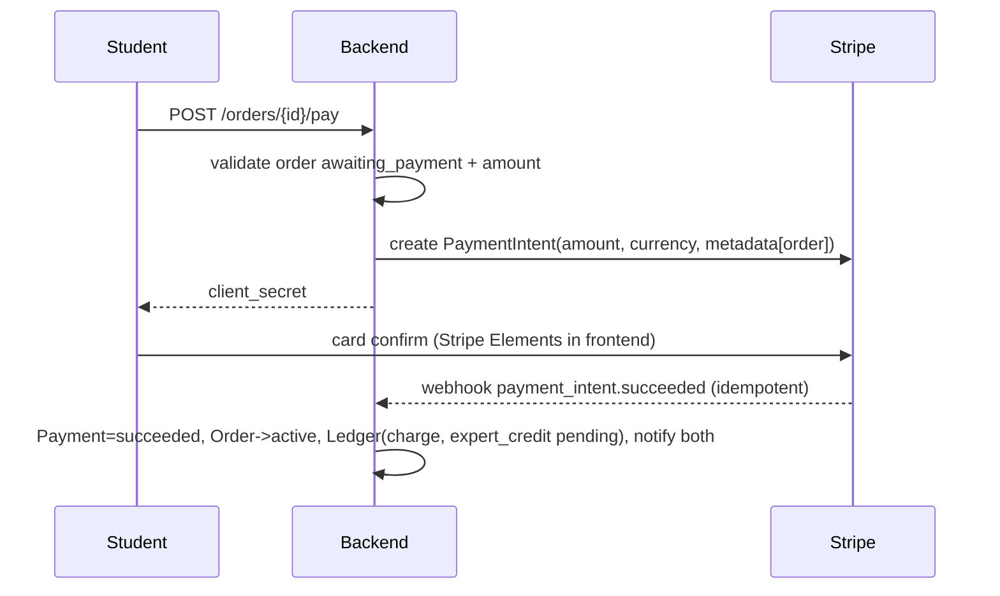

# Payments, Commission, Payouts & Refunds

> Status: ✅ **Phase 7 implemented (provider-agnostic core + ManualGateway; Stripe = prepared seam, not required)** · Last updated: Phase 7 · Related: [business-model](../product/business-model.md), [disputes](disputes.md), [costs](../operations/costs.md)
>
> **Implementation deltas (Phase 7 — no Stripe credentials exist yet, by design):**
>
> - **The whole payment domain runs without Stripe.** `PAYMENT_GATEWAY=manual` is the fully functional default for local dev, tests and CI: create → confirm → order `active` → payout → refund, plus deterministic simulated webhook events. It is a **development/test + operator-confirmed fallback** — simulated confirmations are recorded as gateway `manual` and are never presented as real card transactions.
> - **`StripeGateway` is registered but non-functional** (raises a configuration error listing exactly what is missing). The optional `stripe` SDK is **not** a dependency yet — importing the app, running tests, CI and the ManualGateway flow must never require it. Activation requires the verification checklist at the bottom of this doc (jurisdiction, entity, KYC, currencies, fees, webhooks).
> - **Layering (ADR-0005 amendment):** `apps.payments` stays a *lower* layer because `payments.config` commission rates are imported by bidding/assignments/orders. Payment/Refund/Payout rows reference orders via string FKs (DB-level integrity, no Python import), and order activation is inverted: `payments` emits a `payment_confirmed` domain signal; the **orders app** listens and runs its own `mark_paid` state machine inside the same DB transaction. Webhook ingestion → payment confirmation → order activation is therefore one atomic path with no upward imports.
> - **Minimum domain model (documented choice):** `Payment` (1-1 with order), `Refund`, `Payout`, `LedgerEntry` (append-only), `WebhookEvent` (idempotency). **No `PaymentAttempt`/`PaymentTransaction` tables** — `Payment` is the transaction of record; failure/retry history lives in `Payment.status` + `failure_reason` + audit rows + webhook events, which already satisfies the financial audit trail without a second ledger of attempts.
> - **Ledger identity (BR-32, enforced by the nightly `payments.ledger_check`):** per order, in integer minor units with signed entries — `charge + refund == commission + expert_credit + fee`. Payouts deduct from the `expert_credit` balance; remaining payable balance = `Σ expert_credit − Σ payout`. Provider fees (`fee`) are reserved for real provider receipts (manual gateway books none).
> - Background jobs: `payments.payout_sweeper` (hourly, BR-30 eligibility, creates/sends payouts) and `payments.ledger_check` (nightly invariant check) ship as idempotent django-q2 tasks; schedule creation is ops setup via the admin, same convention as orders/assignments.

## Payment gateway architecture (no fake escrow — BR-29)

A thin `PaymentGateway` interface (adapter pattern) isolates provider specifics. Two adapters ship:

1. **StripeConnectGateway (primary)** — Stripe Connect **separate charges & transfers**:
   - Student pays the full amount via PaymentIntent → funds land on the **platform's Stripe balance** (this *is* the escrow function; no custom custody code).
   - On completion, a Stripe **Transfer** moves the expert's net to their **connected account**; commission (the remainder) simply stays on the platform balance.
   - Refunds issue from the platform balance back to the student.
   - Why not destination charges: refunds and multi-currency expert countries are simpler with charges/transfers; expert accounts can be onboarded after the charge exists.
2. **ManualGateway (fallback)** — for regions unsupported by Stripe (e.g., Pakistan-domiciled platform accounts): student pays via bank/JazzCash/Easypaisa to the platform's business account, submits a reference; admin confirms → order `active`. Payouts are external transfers marked in the ledger by admin. **The ledger, order gating and business rules are identical** — only money rails differ. Selection is via `PAYMENT_GATEWAY` env (per-environment; staging may use Stripe test mode).

Compliance notes: platform is the merchant of record in both modes; Stripe Express onboarding collects expert KYC/tax info (platform never stores it); Stripe TOS requires platform to track Stripe account changes in a decision record if the operating entity's country changes.

## Payment lifecycle

### Charge

- Frontend never mutates payment state; only webhooks (and admin fallback in manual mode) do (BR-33).
- `payments.WebhookEvent` stores raw payloads; processing is at-least-once + idempotent by Stripe event ID.
- Failed payment: order stays `awaiting_payment`; student sees failure reason; retry allowed. `requires_action` (3DS) is handled inside Elements automatically.

### Payout
- Eligibility (BR-30): order `completed` + no open dispute + expert account `enabled` + payout ≥ $10 (else rolls forward).
- Job `payments.payout_sweeper` (hourly): for each eligible completed order → create `Payout(scheduled)` → Stripe `Transfer` to connected account (`source_transaction` linked to the original charge so funds availability is respected) → `paid`.
- Expert UI: per-order gross / commission / net + payout status timeline.
- Failures (account restricted, account closed): `Payout.failed` + admin queue + expert email.

### Refund (BR-31)
| Scenario | Refund | Commission impact |
|---|---|---|
| Order cancelled pre-payment | n/a (nothing charged) | none |
| Expert-fault cancellation (BR-26/27) | 100% to student | commission reversed |
| Platform-fault (BR-14) | 100% + platform absorbs Stripe fee | reversed |
| Student-remorse / mutual (BR-28) | 100% (student may forfeit Stripe fee per admin decision) | reversed |
| Dispute partial resolution | X% student / rest expert | commission scaled proportionally |
| Dispute released to expert | 0% | commission kept |

Refund execution: Stripe `Refund` on the PaymentIntent (+ reversal of any transfer if already moved — Stripe `Transfer Reversal`), ledger entries, order state per disputes doc. Partial refund amounts are admin inputs, validated ≤ remaining balance.

### Disputes & chargebacks
- Product disputes: see [disputes](disputes.md) — outcome executes refunds/transfers.
- **Bank chargebacks**: Stripe notifies via webhook → order flagged `disputed`, evidence submission task on the admin checklist (Stripe dashboard used for evidence; timeline stored in WebhookEvent). Loss → forced refund + ledger reversal. Documented runbook; no automation beyond state flagging in MVP.

## Ledger (BR-32) — financial source of truth

Append-only `payments.LedgerEntry`: `entry_type` (`charge`, `commission`, `expert_credit`, `refund`, `payout`, `fee`, `adjustment`), signed `amount_minor`, currency, order/user refs, description, related Stripe object IDs. Every money event writes entries in one DB transaction with the state change. The admin "Ledger" view + weekly reconciliation query (Stripe balance API vs ledger sums) is the audit trail. Expert "earnings" views are queries over `expert_credit` entries — never denormalized balances that can drift (per-expert aggregate cached view is a later optimization).

## Reconciliation runbook (weekly, admin)

1. Stripe Dashboard balance vs `LedgerEntry` sums per currency (query provided in scripts).
2. Unprocessed/failed webhook list must be empty (else replay).
3. `Payout.failed` queue cleared or escalated.
4. Manual gateway: bank statement vs `Payment(reference)` records.

## Failure modes & handling

| Failure | Handling |
|---|---|
| Webhook never arrives | Stripe event replay from dashboard; nightly job re-checks PIs in non-final states >24h |
| Double webhook | dedup by event ID (BR-33) |
| Refund after payout started | transfer reversal; if insufficient balance, Stripe negative balance — admin-alerted |
| Expert account not onboarded at completion | earnings stay `available`; payout retries when enabled |
| Currency mismatch errors | single-currency MVP (ADR-0009) makes this a validation error at order creation |

## Phase 7 shipped surfaces (implementation reference)

- **Models** (`apps/payments/models.py`): `Payment` (1-1 order; gateway, provider_reference unique-nullable, amount_minor, currency, status `pending|requires_action|processing|succeeded|failed|canceled|refunded|partially_refunded`, failure_reason, receipt/instructions snapshot, timestamps) · `Refund` (payment FK, amount_minor, reason enum + note, provider_reference, status `pending|succeeded|failed`, initiated_by) · `Payout` (order FK, expert FK, amount_minor, status `scheduled|in_transit|paid|failed|reversed`, provider_reference, failure_reason, timestamps) · `LedgerEntry` (append-only: entry_type `charge|commission|expert_credit|refund|payout|fee|adjustment`, signed amount_minor BigInteger, currency, order/user refs, description, provider_object_id) · `WebhookEvent` (provider, event_id unique, type, payload JSONB, status `received|processed|failed`, error, processed_at).
- **Gateway port** (`apps/payments/gateway.py`): `create_payment`, `confirm_payment`, `get_payment_status`, `refund`, `transfer`, `verify_webhook` — registry resolves `PAYMENT_GATEWAY` (`manual` default, `stripe` registered-but-non-functional).
- **Confirmation path** (one implementation for all callers): `payments.services.confirm_payment` → validates order `awaiting_payment` + exact amount parity → `Payment.succeeded` + ledger entries (`charge`, `commission`, `expert_credit` in one transaction) → `payment_confirmed` signal → `orders.mark_paid` (order `active`, `payment_confirmed` OrderEvent, request `in_progress`). Duplicate confirmation, wrong amount, cancelled order, wrong order all raise domain errors and change nothing.
- **Refunds** (`payments.services.issue_refund`): staff-only (BR-26..28 paths; dispute-specific policies stay Phase 9), full or partial, validated against the remaining refundable balance; proportional commission/expert-credit reversal entries; `Payment.status` moves to `refunded|partially_refunded`.
- **Payouts** (`payments.services.schedule_payout` / `settle_payout` / `mark_payout_failed`): scheduled by `payments.payout_sweeper` for completed, dispute-free orders with expert accounts enabled (BR-30; below the $10 floor rolls forward); amount = remaining `expert_credit` ledger balance; ledger `payout` entry on settlement; failures carry a reason and requeue.
- **Webhooks** (`payments.webhooks.ingest`): `POST /api/v1/payments/webhooks/<provider>` — signature verification delegated to the gateway, raw payload stored, `event_id` unique (replays are no-ops returning `200 already_processed`), processing retry-safe, failures visible in admin with a replay action.
- **Stripe readiness checklist (before ANY production activation — verify, never assume):** operating country & Stripe availability for the platform entity · business entity + bank account (marketplace/payout capable) · supported currency list vs ADR-0009 · Connect account type + KYC/KCE flow for experts · fee schedule (platform + payout + refund + FX) · refund/chargeback behavior windows · webhook endpoint requirements & signing · webhook secret rotation runbook. The `stripe` SDK is added only in the commit that activates it, behind `STRIPE_SECRET_KEY`/`STRIPE_WEBHOOK_SECRET`/`STRIPE_API_COUNTRY`.
