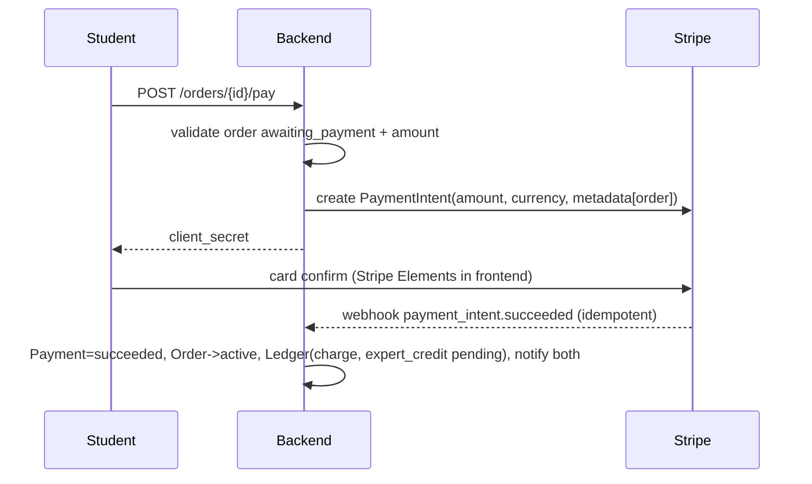

# Payments, Commission, Payouts & Refunds

> Status: 📐 Phase 0 · Last updated: 2026-09-23 · Related: [business-model](../product/business-model.md), [disputes](disputes.md), [costs](../operations/costs.md)

## Payment gateway architecture (no fake escrow — BR-29)

A thin `PaymentGateway` interface (adapter pattern) isolates provider specifics. Two adapters ship:

1. **StripeConnectGateway (primary)** — Stripe Connect **separate charges & transfers**:
   - Student pays the full amount via PaymentIntent → funds land on the **platform's Stripe balance** (this *is* the escrow function; no custom custody code).
   - On completion, a Stripe **Transfer** moves the expert's net to their **connected account**; commission (the remainder) simply stays on the platform balance.
   - Refunds issue from the platform balance back to the student.
   - Why not destination charges: refunds and multi-currency expert countries are simpler with charges/transfers; expert accounts can be onboarded after the charge exists.
2. **ManualGateway (fallback)** — for regions unsupported by Stripe (e.g., Pakistan-domiciled platform accounts): student pays via bank/JazzCash/Easypaisa to the platform's business account, submits a reference; admin confirms → order `active`. Payouts are external transfers marked in the ledger by admin. **The ledger, order gating and business rules are identical** — only money rails differ. Selection is via `PAYMENT_GATEWAY` env (per-environment; staging may use Stripe test mode).

Compliance notes: platform is the merchant of record in both modes; Stripe Express onboarding collects expert KYC/tax info (platform never stores it); Stripe TOS requires platform to track Stripe account changes in a decision record if the operating entity's country changes.

## Payment lifecycle

### Charge

- Frontend never mutates payment state; only webhooks (and admin fallback in manual mode) do (BR-33).
- `payments.WebhookEvent` stores raw payloads; processing is at-least-once + idempotent by Stripe event ID.
- Failed payment: order stays `awaiting_payment`; student sees failure reason; retry allowed. `requires_action` (3DS) is handled inside Elements automatically.

### Payout
- Eligibility (BR-30): order `completed` + no open dispute + expert account `enabled` + payout ≥ $10 (else rolls forward).
- Job `payments.payout_sweeper` (hourly): for each eligible completed order → create `Payout(scheduled)` → Stripe `Transfer` to connected account (`source_transaction` linked to the original charge so funds availability is respected) → `paid`.
- Expert UI: per-order gross / commission / net + payout status timeline.
- Failures (account restricted, account closed): `Payout.failed` + admin queue + expert email.

### Refund (BR-31)
| Scenario | Refund | Commission impact |
|---|---|---|
| Order cancelled pre-payment | n/a (nothing charged) | none |
| Expert-fault cancellation (BR-26/27) | 100% to student | commission reversed |
| Platform-fault (BR-14) | 100% + platform absorbs Stripe fee | reversed |
| Student-remorse / mutual (BR-28) | 100% (student may forfeit Stripe fee per admin decision) | reversed |
| Dispute partial resolution | X% student / rest expert | commission scaled proportionally |
| Dispute released to expert | 0% | commission kept |

Refund execution: Stripe `Refund` on the PaymentIntent (+ reversal of any transfer if already moved — Stripe `Transfer Reversal`), ledger entries, order state per disputes doc. Partial refund amounts are admin inputs, validated ≤ remaining balance.

### Disputes & chargebacks
- Product disputes: see [disputes](disputes.md) — outcome executes refunds/transfers.
- **Bank chargebacks**: Stripe notifies via webhook → order flagged `disputed`, evidence submission task on the admin checklist (Stripe dashboard used for evidence; timeline stored in WebhookEvent). Loss → forced refund + ledger reversal. Documented runbook; no automation beyond state flagging in MVP.

## Ledger (BR-32) — financial source of truth

Append-only `payments.LedgerEntry`: `entry_type` (`charge`, `commission`, `expert_credit`, `refund`, `payout`, `fee`, `adjustment`), signed `amount_minor`, currency, order/user refs, description, related Stripe object IDs. Every money event writes entries in one DB transaction with the state change. The admin "Ledger" view + weekly reconciliation query (Stripe balance API vs ledger sums) is the audit trail. Expert "earnings" views are queries over `expert_credit` entries — never denormalized balances that can drift (per-expert aggregate cached view is a later optimization).

## Reconciliation runbook (weekly, admin)

1. Stripe Dashboard balance vs `LedgerEntry` sums per currency (query provided in scripts).
2. Unprocessed/failed webhook list must be empty (else replay).
3. `Payout.failed` queue cleared or escalated.
4. Manual gateway: bank statement vs `Payment(reference)` records.

## Failure modes & handling

| Failure | Handling |
|---|---|
| Webhook never arrives | Stripe event replay from dashboard; nightly job re-checks PIs in non-final states >24h |
| Double webhook | dedup by event ID (BR-33) |
| Refund after payout started | transfer reversal; if insufficient balance, Stripe negative balance — admin-alerted |
| Expert account not onboarded at completion | earnings stay `available`; payout retries when enabled |
| Currency mismatch errors | single-currency MVP (ADR-0009) makes this a validation error at order creation |
